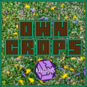

# OwnCrops

    

*Customize your Farming Experience* • [Downloads](https://github.com/Ender-Development/OwnCrops-Fabric/releases) • [CurseForge](https://www.curseforge.com/minecraft/mc-mods/owncrops-fabric)

&nbsp;

## Introduction

OwnCrops is a Mod for Minecraft made by `Ender-Development`.

It allows Modpacks to add new Crops without the need of making a seperate mod for them. We utilize [KubeJS](https://github.com/KubeJS-Mods/KubeJS) by [LatvianModder](https://github.com/LatvianModder) to make the process of adding new crops for the user even easier.

### Example

[Here](run/kubejs/startup_scripts/script.js) is a working documented example on how to use the mod.
The shown resources are located [here](run/kubejs/assets/owncrops/textures/).

## [Ender-Development](https://github.com/Ender-Development)

Our Team currently includes:

`_MasterEnderman_` - Project-Manager, Lead-Artist, Developer

- BuyMeACoffee: <https://www.buymeacoffee.com/masterenderman>
- Curseforge: <https://www.curseforge.com/members/endermanwhosearchthebeast/projects>
- Discord: <https://discord.gg/JF7x2vG>
- GitHub: <https://github.com/masterenderman>
- Patreon: <https://www.patreon.com/_masterenderman_>
- Twitch: <https://www.twitch.tv/endermanwhosearchthebeast>
- Twitter: <https://twitter.com/_bitfabrik_>
- Youtube: <https://www.youtube.com/user/xxmasterendermanxx>

`Klebestreifen` - Lead-Developer, Artist

- Curseforge: <https://www.curseforge.com/members/klebe0815/projects>
- Discord: <https://discord.gg/nva5gGt>
- GitHub: <https://github.com/Klebestreifen>
- Twitch: <https://www.twitch.tv/klebe0815>
- Website: <https://klebe.io/>

## Community

Ender-Development is part of a Gaming Community called `Pixel-Friends.com`

- Website: <https://pixel-friends.com>
- Facebook: <http://facebook.com/GrischaNetwork/>
- Twitter: <http://twitter.com/GrischaNetwork>
- Twitch: <http://twitch.tv/grischabock>
- Steam: <http://steamcommunity.com/groups/Pixel-Friends>
- Instagram: <http://instagram.com/grischanetwork>
